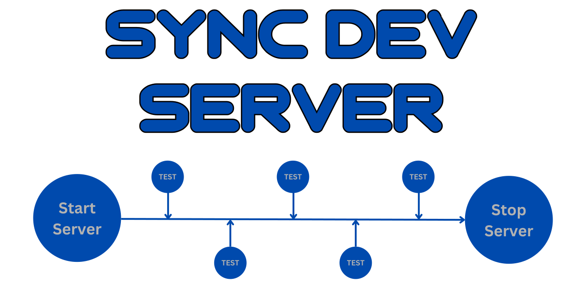

<div align="center">

# [](https://github.com/nktnet1/sync-dev-server)

[](https://github.com/nktnet1/sync-dev-server/actions/workflows/pipeline.yml)
&nbsp;
[](https://codecov.io/gh/nktnet1/sync-dev-server)
&nbsp;
[](https://codeclimate.com/github/nktnet1/sync-dev-server/maintainability)
&nbsp;
[](https://snyk.io/test/github/nktnet1/sync-dev-server)
&nbsp;
[](https://github.com/search?q=repo%3Anktnet1%2Fsync-dev-server++language%3ATypeScript&type=code)

[](https://www.npmjs.com/package/sync-dev-server?activeTab=versions)
&nbsp;
[](https://packagephobia.com/result?p=sync-dev-server)
&nbsp;
[](https://depfu.com/github/nktnet1/sync-dev-server?project_id=39032)
&nbsp;
[](https://app.fossa.com/projects/git%2Bgithub.com%2Fnktnet1%2Fsync-dev-server?ref=badge_shield)
&nbsp;
[](https://opensource.org/license/mit/)
&nbsp;
[](https://github.com/nktnet1/sync-dev-server/issues)

[](https://sonarcloud.io/summary/new_code?id=nktnet1_sync-dev-server)
&nbsp;
[](https://app.codacy.com/gh/nktnet1/sync-dev-server/dashboard?utm_source=gh&utm_medium=referral&utm_content=&utm_campaign=Badge_grade)
&nbsp;
[](https://app.deepsource.com/gh/nktnet1/sync-dev-server/)
&nbsp;
[](https://codebeat.co/projects/github-com-nktnet1-sync-dev-server-main)
&nbsp;
[](https://github.com/nktnet1/sync-dev-server/stargazers)

[](https://moiva.io/?npm=sync-dev-server)
&nbsp;
[](https://moiva.io/?npm=sync-dev-server)
&nbsp;
[](https://moiva.io/?npm=sync-dev-server)
&nbsp;
[](https://moiva.io/?npm=sync-dev-server)
&nbsp;
[](https://moiva.io/?npm=sync-dev-server)

---

Starts a server before your tests and stops on completion

Inspired by [jest-puppeteer](https://github.com/argos-ci/jest-puppeteer)'s subpackage [jest-dev-server](https://github.com/argos-ci/jest-puppeteer/tree/main/packages/jest-dev-server#readme)

Setup and teardown operations are fully synchronous

[](https://replit.com/@nktnet1/sync-dev-server-example#index.js)

</div>

---

- [1. Installation](#1-installation)
- [2. Usage](#2-usage)
    - [2.1. startServer](#21-startserver)
        - [2.1.1. command](#211-command)
        - [2.1.2. options](#212-options)
            - [2.1.2.1. host](#2121-host)
            - [2.1.2.2. port](#2122-port)
            - [2.1.2.3. timeout](#2123-timeout)
            - [2.1.2.4. debug](#2124-debug)
            - [2.1.2.5. signal](#2125-signal)
            - [2.1.2.6. usedPortAction](#2126-usedportaction)
            - [2.1.2.7. env](#2127-env)
            - [2.1.2.8. isServerReadyFn](#2128-isserverreadyfn)
    - [2.2. stopServer](#22-stopserver)
        - [2.2.1. server](#221-server)
        - [2.2.2. signal](#222-signal)
- [3. License](#3-license)
- [4. Limitations](#4-limitations)
- [5. Caveats](#5-caveats)

## 1. Installation

```
npm install sync-dev-server
```

## 2. Usage

Try with [Replit](https://replit.com/@nktnet1/sync-dev-server-example#index.js).

```
startServer(command, options);
stopServer(server, signal);
```

Full example, specifying all options:

```javascript
// const { startServer, stopServer } = require('sync-dev-server');
import { startServer, stopServer } from 'sync-dev-server';

const options = {
  // Note: all fields below are optional with set defaults
  host: '127.0.0.1',
  port: 49152,
  timeout: 10000,
  debug: true,
  signal: 'SIGINT',
  usedPortAction: 'ignore', // alternatives are 'kill' and 'error'
  env: {
    secretKey: "bruno's fight club"
  },
}

const server = startServer('npm start', options);

// Send requests to the server or perform other operations
// ...
// ...
// ...

stopServer(server, 'SIGINT');
```

When using [Jest](https://jestjs.io), you can create and stop the server using [Setup and Teardown](https://jestjs.io/docs/setup-teardown), for example with [beforeAll](https://jestjs.io/docs/api#beforeallfn-timeout) and [afterAll](https://jestjs.io/docs/api#afterallfn-timeout).
To start and stop the server for all test suites, look into [setupFiles](https://jestjs.io/docs/configuration#setupfiles-array), [setupFilesAfterEnv](https://jestjs.io/docs/configuration#setupfilesafterenv-array), [globalSetup](https://jestjs.io/docs/configuration#globalsetup-string) and [globalTeardown](https://jestjs.io/docs/configuration#globalteardown-string).

### 2.1. startServer

#### 2.1.1. command

Type: `string`

The command to start your server with. Below are a few examples:
```
npm start
npm run dev
yarn start
node src/app.js
ts-node src/server.ts
```

#### 2.1.2. options

In [src/types.ts](src/types.ts), the options interface is defined as:

```typescript
type UsedPortAction = 'error' | 'ignore' | 'kill';

interface Options {
  host?: string;
  port?: number;
  timeout?: number;
  debug?: boolean;
  signal?: string | number;
  usedPortAction?: UsedPortAction;
  env?: Record<string, string>;
}
```

##### 2.1.2.1. host

Type: `string`, Default: `undefined`

Host to wait for activity before considering that the server is running.

If not specified, no `address` will be passed into [node-netstat](https://github.com/danielkrainas/node-netstat). This means that all local addresses will be checked, including `localhost`, `127.0.0.1`, `0.0.0.0`, etc.

##### 2.1.2.2. port

Type: `number`, Default: `5000`

Port to wait for activity before considering that the server is running.

##### 2.1.2.3. timeout

Type: `number`, Default: `10000`

The timeout for individual tasks (not total time), which are:
1. The number of milliseconds to wait for the spawned server to be available before giving up
2. The number of milliseconds to wait for an existing server to be killed if `options.usedPortAction === 'kill'`

##### 2.1.2.4. debug

Type: `boolean`, Default: `true`

Logs the server output to `stdout` if true, ignore `stdout` otherwise.

##### 2.1.2.5. signal

Type: `number | string`

Default: `'SIGTERM'` (`15`)

The [inter-process communication signals](https://en.wikipedia.org/wiki/Signal_(IPC)) that will be used to kill any existing server, if `options.usedPortAction === 'kill'`.

##### 2.1.2.6. usedPortAction

Type: `'error' | 'ignore' | 'kill'`. Default: `'error'`

A string that defines the action to take if the given port is already in use, whereby
- `error`: Throws a generic [Error](https://nodejs.org/api/errors.html#class-error) object
- `ignore`: Assumes that the server is already started. `startServer` will return `null`.
- `kill`: the process occupying this port is automatically killed

#### 2.1.2.7. env

Type: `Record<string, string>`. Default: `{}`

Any environment variables you want to pass into the spawned server. This will take precedence over existing variables in `process.env`.

#### 2.1.2.8. isServerReadyFn

Type: `(() => boolean) | null`. Default: `null`

Optional callback function to check if the server has started successfully. If not specified (or `null`),
the default [node-netstat](https://github.com/danielkrainas/node-netstat) library is used to scan for the
port status. Note that there is an
[open issue with MacOS Sonoma onwards](https://github.com/danielkrainas/node-netstat/issues/43).

### 2.2. stopServer

#### 2.2.1. server

Type: [`ChildProcess`](https://nodejs.org/api/child_process.html#class-childprocess) | `null`

The server child process returned from [`startServer`](#21-startserver). 

`stopServer` will do nothing if `null` is passed.

#### 2.2.2. signal

Type: `number | string`. Default: `'SIGTERM'` (`15`)

The [inter-process communication signals](https://en.wikipedia.org/wiki/Signal_(IPC)) that will be used to kill the server.

## 3. License

<details closed>
<summary>
  Massachusetts Institute of Technology
  (<a href="https://opensource.org/license/mit" target="_blank">MIT</a>)
</summary>

<br/>

```
Copyright (c) 2023 Khiet Tam Nguyen

Permission is hereby granted, free of charge, to any person obtaining a
copy of this software and associated documentation files (the “Software”),
to deal in the Software without restriction, including without limitation
the rights to use, copy, modify, merge, publish, distribute, sublicense,
and/or sell copies of the Software, and to permit persons to whom the
Software is furnished to do so, subject to the following conditions:

The above copyright notice and this permission notice shall be included in
all copies or substantial portions of the Software.

THE SOFTWARE IS PROVIDED “AS IS”, WITHOUT WARRANTY OF ANY KIND, EXPRESS OR
IMPLIED, INCLUDING BUT NOT LIMITED TO THE WARRANTIES OF MERCHANTABILITY,
FITNESS FOR A PARTICULAR PURPOSE AND NONINFRINGEMENT. IN NO EVENT SHALL
THE AUTHORS OR COPYRIGHT HOLDERS BE LIABLE FOR ANY CLAIM, DAMAGES OR OTHER
LIABILITY, WHETHER IN AN ACTION OF CONTRACT, TORT OR OTHERWISE, ARISING
FROM, OUT OF OR IN CONNECTION WITH THE SOFTWARE OR THE USE OR OTHER
DEALINGS IN THE SOFTWARE.
```

[](https://app.fossa.com/projects/git%2Bgithub.com%2Fnktnet1%2Fsync-dev-server?ref=badge_large)

</details>

## 4. Limitations

There are currently no known limitations.

## 5. Caveats

**sync-dev-server** has been tested on Linux, Windows and MacOS.

It leverages [node-netstat](https://github.com/danielkrainas/node-netstat), [kill-sync](https://github.com/nktnet1/kill-sync), [dns-lookup-sync](https://github.com/nktnet1/dns-lookup-sync) and [slync](https://github.com/nktnet1/slync) which are all cross-platform.